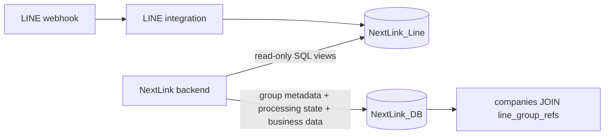

# LINE data over direct SQL

NextLink and LINE integration are one product with separate deployments and separate databases. `LINE_DATA_MODE=direct` reads `NextLink_Line` through SQL. It no longer calls the bot's changes API and does not replicate message bodies. The default `shared` mode exists only for a staged upgrade of the old deployment; `api` is rejected rather than silently falling back to shared tables.

## Ownership and reads



- `line_group_refs`: ID, name, picture URL metadata, activity/deletion status, version and timestamps. It is small and supports local company/token-log foreign keys. No image is downloaded.
- `line_message_processing`: message/group IDs, current/processed versions, eligibility and review flags. **No text, raw payload, files or images.** It records work, not a second message history.
- `line_direct_sync_state`: pinned source UUID, committed cursor, bootstrap boundary and cutover state.
- Source `line_read_messages` is a normal SQL view, not a materialized copy. It exposes only current inbound group text; excludes direct chats, outbound text, attachments and unsent messages.
- Message text is fetched into memory immediately before AI extraction. NextLink stores the resulting business data and graph outbox records, not the source conversation. Existing application/AI features outside this integration retain their own storage behavior.

## Rollout order

This runbook is configuration work, not a claim that production already runs this code. Stop the old shared/API consumer for the data/state cutover. Back up both actual runtime databases and verify the Neon projects, production branches and database names first. Do not rerun the old Railway final-copy script after Neon has received live traffic.

1. In **NextLink_Line**, use the bot's migration runner to apply migration `023_direct_sql_reader.sql`. Earlier migrations, including 021's commit-ordered key log, remain immutable. This adds three views and an index; it does not duplicate message storage.
2. Create a dedicated login using the SQL below in that source database. Set its password privately (for example psql `\password nextlink_line_reader`); do not use `neondb_owner` or a Neon role with broad inherited permissions. Verify its grants before using its pooled TLS connection string in the backend.
3. In **NextLink_DB**, run `migrations/line_direct.sql`. This creates group references and compact work state. It adopts old `is_read` or an earlier API projection if present, but never copies their text. Adoption is guarded to run once. The old API SQL files were replaced in this unmerged branch; existing tables are left intact for reviewed retirement after backup and cutover.
4. Set the server-only variables below. Pin `LINE_SOURCE_ID` to the verified `line_read_identity.source_id`. Do not send either database credential to the browser.
5. As staff, call `POST /api/v1/line/sync` until `has_more=false`. Each call processes at most 1,000 metadata changes. A page and its cursor commit atomically in NextLink. Wrong source UUID, owner credentials, a restored source behind the cursor, and source outages fail without acknowledging work.
6. With the old consumer stopped, run `migrations/line_direct_cutover.sql` in NextLink_DB. It verifies catch-up and group mappings, retargets `companies.group_id` and `token_logs.group_id` to the local group references, and enables extraction. Company IDs and existing relationships are preserved.
7. Verify staff group refresh, existing company mappings, a controlled extraction and its source IDs/versions. Only then retire old source/projection tables through a separately reviewed backup/dependency check. This code does not delete old Railway snapshot tables already present in NextLink_DB.

```sql
-- Execute only in the verified LINE source database as its administrator.
CREATE ROLE nextlink_line_reader LOGIN NOINHERIT NOSUPERUSER NOCREATEDB NOCREATEROLE NOREPLICATION;
GRANT USAGE ON SCHEMA public TO nextlink_line_reader;
GRANT SELECT ON line_read_identity,line_read_changes,line_read_messages TO nextlink_line_reader;
-- Set password privately. Do not grant membership in an owner role,
-- SELECT on all tables, writes, schema ownership or raw-payload access.
```

The backend enforces read-only transactions and rejects credentials with privileges on source `line_*` base tables. Source connections use a separate pool (default 3, maximum 5 per process), connect timeout 5s, statement timeout 10s, transaction-local settings compatible with Neon pooling, and release snapshots/connections before AI calls. Database permissions are the security boundary; read-only transaction mode is an additional safeguard. See PostgreSQL's [GRANT](https://www.postgresql.org/docs/current/sql-grant.html) and [SET TRANSACTION](https://www.postgresql.org/docs/current/sql-set-transaction.html).

```dotenv
DATABASE_PUBLIC_URL=<NextLink_DB application credential>
LINE_DATA_MODE=direct
LINE_DATABASE_URL=<NextLink_Line dedicated reader, pooled connection with TLS>
LINE_SOURCE_ID=<verified source UUID>
LINE_PG_POOL_MAX=3
```

Remove obsolete `LINE_INTEGRATION_URL`, `LINE_INTEGRATION_API_KEY` and `LINE_INTEGRATION_SOURCE_ID` from the backend configuration. The bot no longer needs `INTEGRATION_API_KEY`. Keep LINE channel credentials, outbound authentication and recovery keys: they serve different operations.

## Existing JOINs and processing

`GET /api/v1/line/groups` syncs metadata over SQL before joining `companies` with `line_group_refs` locally. The AI update does the same catch-up first. These are existing authenticated frontend-facing routes, not an inter-service data API. No background metadata scheduler is added; between refresh/extraction calls, local names and review flags can be stale.

Extraction claims a group and at most 200 pending message IDs in **NextLink_DB**. It reads their exact versions from LINE SQL, calls AI, rechecks the versions, and commits business data, `graph_outbox` and the selected processing acknowledgements together. It never writes `line_messages.is_read` in the source. New arrivals remain pending; parallel requests cannot extract the same group simultaneously. AI/network failures before commit leave work retryable; LLM calls themselves are not guaranteed exactly once.

A later edit/unsend of already-processed text sets `needs_review=true`; it is not automatically extracted again into duplicate business records. If a change is observed during the AI call, results and acknowledgements are not committed. The databases cannot share one atomic transaction: a change just after the final source check is caught by subsequent metadata sync and flagged for review. Already-generated employee/graph records are not automatically retracted, and there is no review UI yet.

Legacy `is_read` lacks a recorded content version. Bootstrap preserves it as an explicit baseline and flags it for review; it cannot prove which historical text the old AI consumed. Source identity and message versions must be preserved across restores. Do not truncate the source change log or reset the local cursor independently.

Rollback is not an environment toggle: the old shared snapshot misses new messages and acknowledgements. Preserve and reconcile data/state and restore appropriate FKs before reverting consumers.

## Verification

`backend/tests/test_line_direct.py` runs with real PostgreSQL databases, view-only reader credentials and synthetic AI. It covers metadata-only persistence, migrations/FKs, source guards/outages, cursor rollback, pagination, bootstrap state, concurrent extraction, new arrivals, edit/unsend and transactional graph outbox. The source-side fixture represents SQL contract v2; the LINE repository separately tests migration 023 against its actual ingestion schema and repository operations. CI does not need the private bot repository or production secrets.

```bash
TEST_DATABASE_URL=postgresql://<test-user>:<test-password>@127.0.0.1:5432/nextlink_security_test \
  python -m pytest backend/tests -q
```

The supplied test user needs database/role creation privileges for disposable fixtures. The hostname and database prefix guard reject production targets. No real LINE, LLM or Neo4j calls are made.
